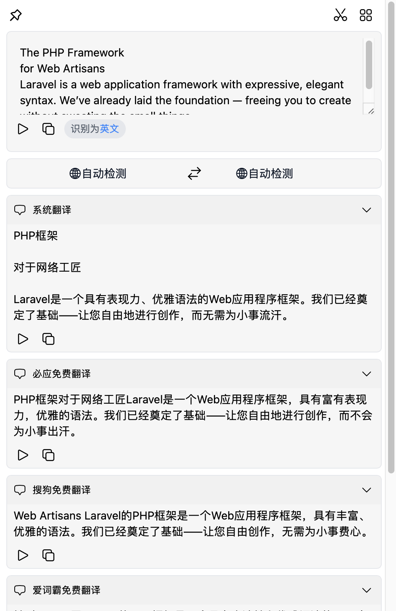
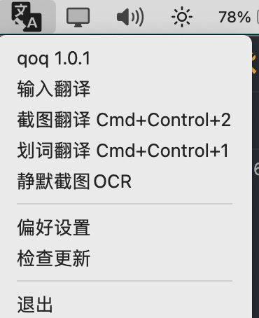
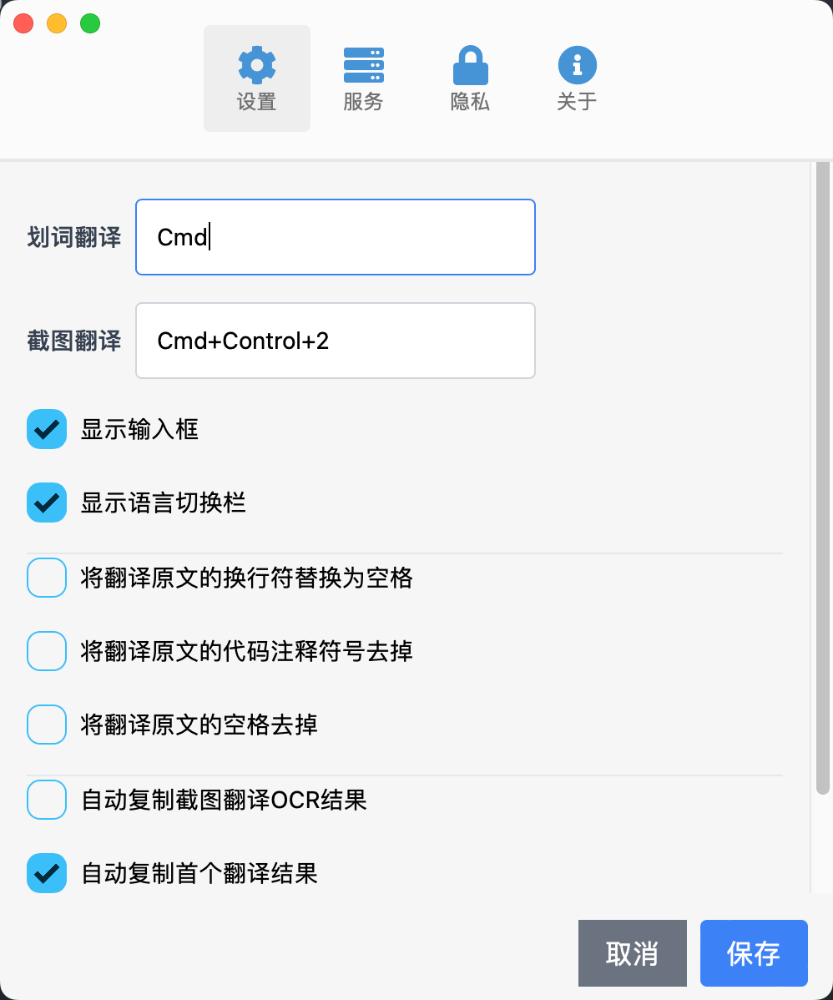
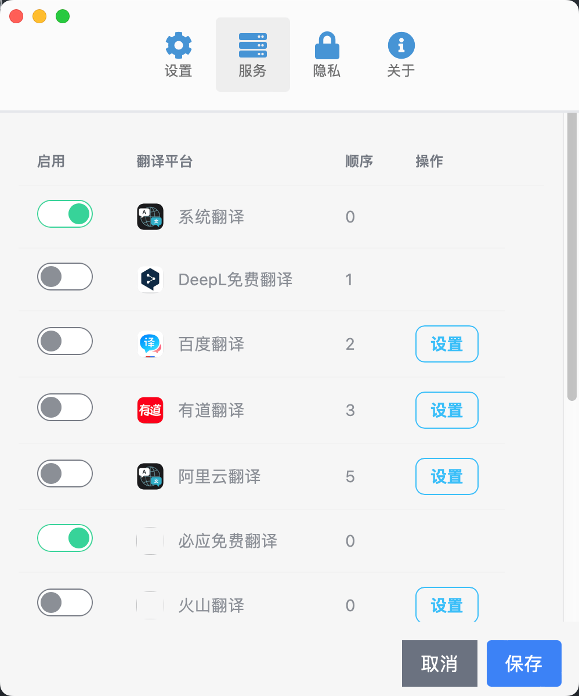

# go-qoq


一款go语言开发的跨平台翻译软件

项目由 [wails](https://github.com/wailsapp/wails) 框架完成


# 进度

- [x] qoq翻译 macOS 系统核心功能完成
- [ ] macOS 打包为应用 待完成
- [ ] Window 待开发


# 使用

编译应用

```
wails build
```

调试应用

```
直接在goland 运行 main.go 即可
```


## macOS 系统翻译

如果想要通过 `Easydict` 调用苹果 🍎 系统翻译，系统需要在 **macOS 12.3.1** 以上。

此外还需要安装一个快捷指令（`Easydict-Translate-V1.2.0`），请用 **Safari 浏览器** 打开下方链接。

```
https://www.icloud.com/shortcuts/776f8a1d8e43471885e8a505eb9a9deb
```

安装后即可使用


本项目参考

[tisfeng/Easydict: 一个简洁优雅的翻译词典 macOS App](https://github.com/tisfeng/Easydict)












## 声明

qoq 为 [GPL-3.0](https://github.com/tisfeng/Easydict/blob/main/LICENSE) 开源协议，仅供学习交流，任何人都可以免费获取该产品和源代码。如果你认为您的合法权益受到侵犯，请立即联系[作者](https://github.com/duolabmeng6)。你可以自由使用源代码，但必须附上相应的许可证和版权声明。
